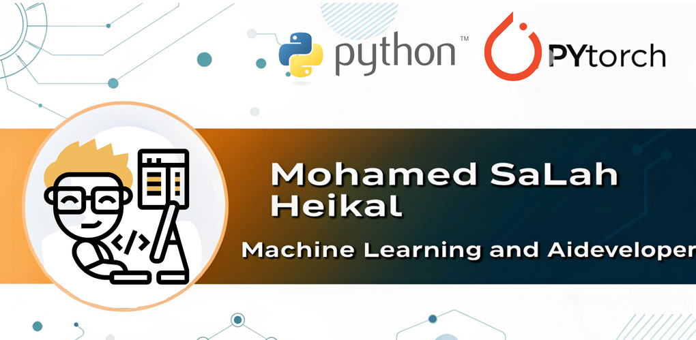

# 🌟 Mohamed Salah | Junior AI Engineer 🌟  

  
  
  

---

 <!-- Replace with your banner image -->

---

## 👋 About Me  

 <!-- Replace with your avatar image -->

Hi! I'm **Mohamed Salah**, a passionate **Junior AI Engineer** specializing in cutting-edge **AI solutions**, including:  

- 🌍 **Machine Learning** | 🤖 **Deep Learning** | 🖼️ **Computer Vision**  
- 📝 **Natural Language Processing (NLP)** | 💬 **Chatbots** | ⚙️ **RAG Systems**  

Graduated with honors in **Computer Science and AI** (GPA: **3.82**, 3rd in class), I thrive at the intersection of **innovation** and **problem-solving**.

🌟 My philosophy: **AI for Good** — creating solutions that make a real-world impact.  

📧 **Reach Me At**: [mohamedhikal943@gmail.com](mailto:mohamedhikal943@gmail.com)  

---

## 🚀 Tools & Technologies  

| Programming Languages | Frameworks & Libraries | Tools |
|:---------------------:|:----------------------:|:-----:|
|     |    |    |

---

## 💡 Featured Projects  

### **🌟 AI Solutions & Research**  
| Project Name | Description | Repository Link |
|:------------:|:-----------:|:----------------:|
| **[Hierarchical Deep Temporal Models for Group Activity Recognition](https://github.com/mosalah19/hierarchical-deep-temporal-model-)** | Recognizing group activities in video using deep learning. | [🔗 Repo](https://github.com/mosalah19/hierarchical-deep-temporal-model-) |
| **[Retinal Disease Support System](https://github.com/mosalah19/RDSS)** | AI-based assistant for retinal disease diagnosis. | [🔗 Repo](https://github.com/mosalah19/RDSS) |
| **[German Traffic Sign Recognition](https://www.kaggle.com/code/mohamedsalahcsai2020/german-traffic-sign-recognition-project/edit)** | Classify traffic signs using CNNs. | [🔗 Kaggle](https://www.kaggle.com/code/mohamedsalahcsai2020/german-traffic-sign-recognition-project/edit) |

---

### **⚙️ From Scratch Implementations**  
| Project Name | Description | Repository Link |
|:------------:|:-----------:|:----------------:|
| **[Micrograd](https://github.com/mosalah19/building-micrograd)** | Minimal autograd library implemented from scratch. | [🔗 Repo](https://github.com/mosalah19/building-micrograd) |
| **[KNN From Scratch](https://github.com/mosalah19/Knn_from_skratch)** | Implementation of k-Nearest Neighbors algorithm. | [🔗 Repo](https://github.com/mosalah19/Knn_from_skratch) |
| **[NN for Regression](https://github.com/mosalah19/NN_for_Regression)** | Simple neural network for regression. | [🔗 Repo](https://github.com/mosalah19/NN_for_Regression) |

---

### **📊 Classical Machine Learning**  
| Project Name | Description | Repository Link |
|:------------:|:-----------:|:----------------:|
| **[Credit Card Classification](https://github.com/mosalah19/CreditCard_Classification)** | Predict fraudulent transactions. | [🔗 Repo](https://github.com/mosalah19/CreditCard_Classification) |
| **[Trip Duration NYC](https://github.com/mosalah19/TripDurationNYC)** | Predict trip duration in NYC. | [🔗 Repo](https://github.com/mosalah19/TripDurationNYC) |
| **[Career Compass Analytics](https://github.com/mosalah19/CareerCompassAnalytics)** | Analytics for career recommendations. | [🔗 Repo](https://github.com/mosalah19/CareerCompassAnalytics) |

---

## 📈 GitHub Stats  

  
  

---

## 🌐 Let's Connect  

  
  
📧 **Email**: [mohamedhikal943@gmail.com](mailto:mohamedhikal943@gmail.com)

